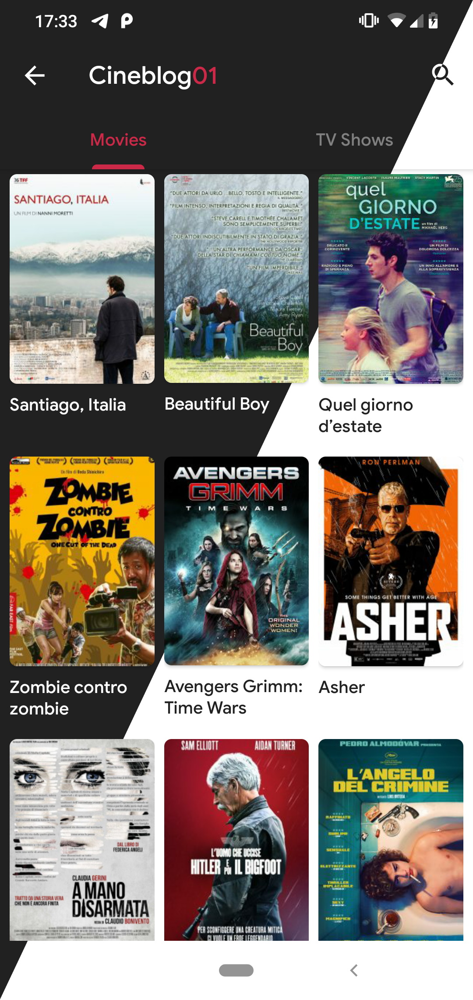
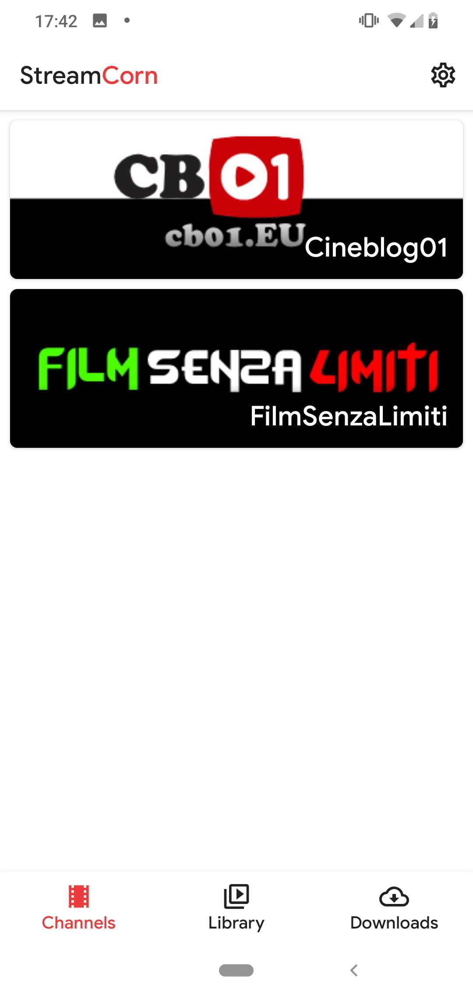
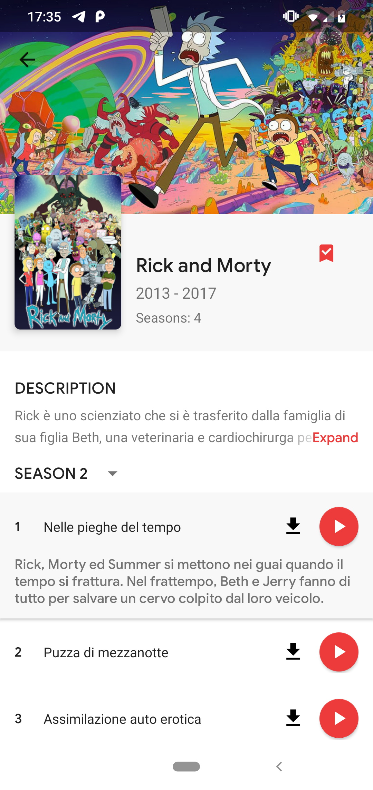
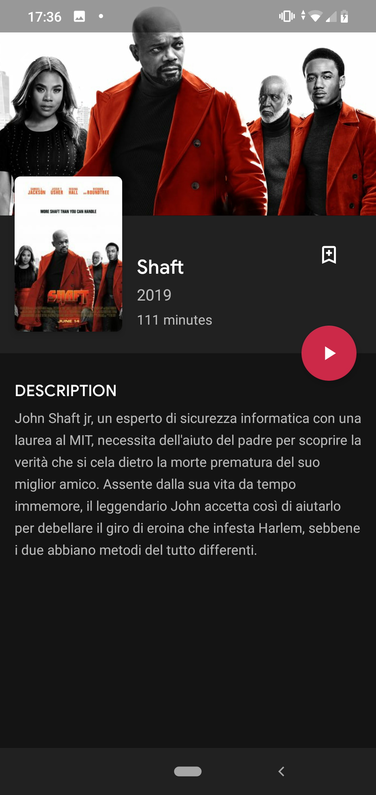

<h1 align='center'>StreamCorn</h1>

A simple app for scraping and playing movie and TV shows from streaming websites.

## Features
 - Scrape streaming website links
 - Movie and TV shows info from TMDB rest API
 - Play media with VLC

## Screenshots

 

